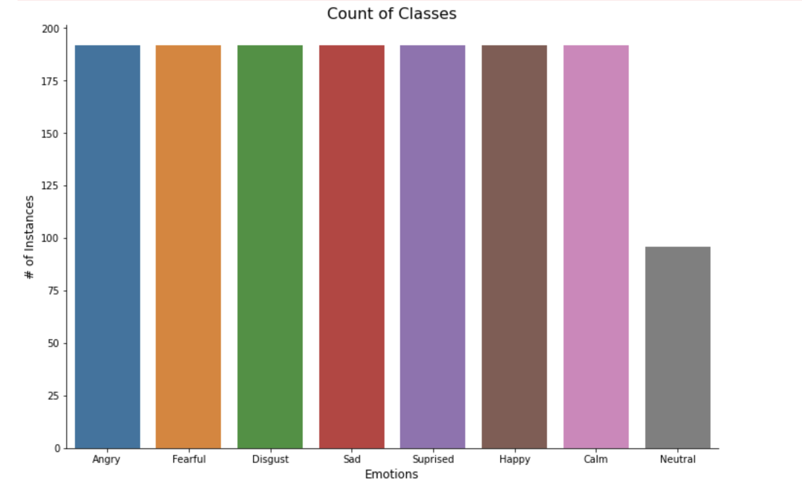
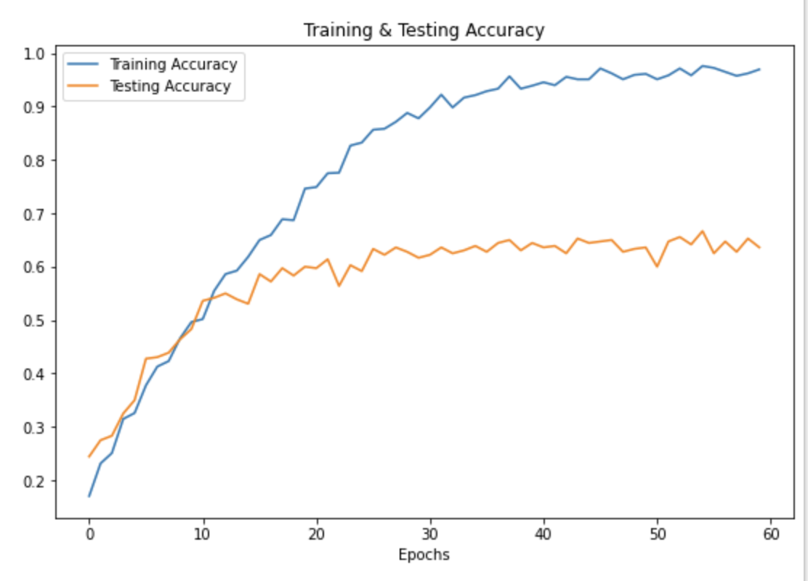
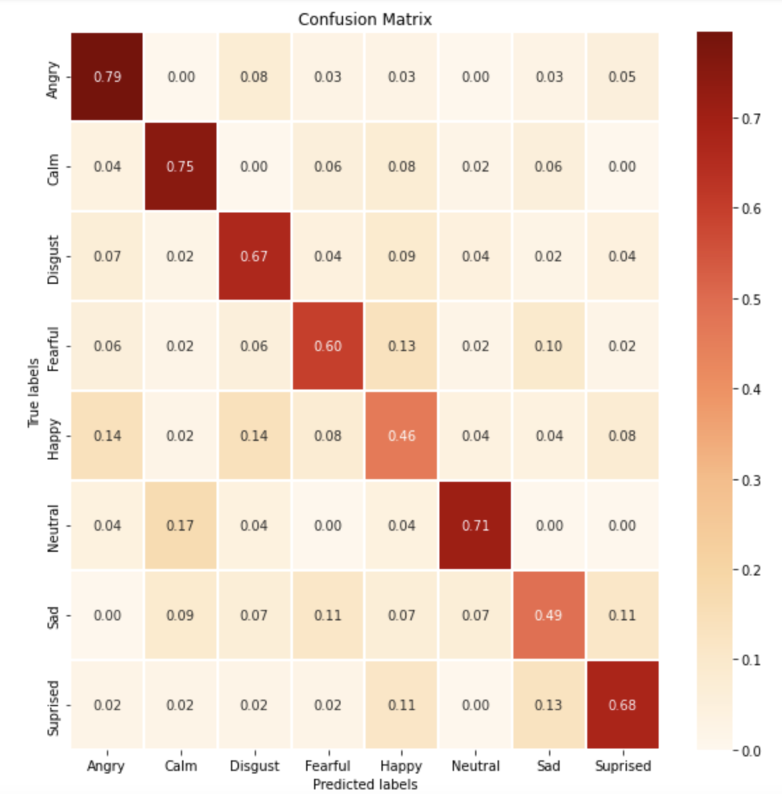

#  GA Capstone- Readme

### Problem Statement

My goal with this project is to provide myself and other students with a reasonable means of being able to record themselves and predict their tone and emotion in hopes that it benefits them as they prepare for technical interviews. In this, I hope to classify emotions off of audio data and develop a web app that can be utilized by other students. 

A successful model would score higher than an average baseline metric of 12% (probability of guessing an emotion without replacement), and would include a fully functioning web app.

### Background

Audio has been used in prediction modeling for the better part of several years. In primary use cases, audio can function similarly to text and visual feedback in that we can derive sentiment from it. In the labor market, 70% of managers expect negotiations to happen at the time of the offer, while only 46% and 34% of men and women take them up on it. The ability to communicate and negotiate with the utmost confidence is absolutely a benefit to any GA student entering into the workforce, and a classification app that can provide immense benefit alongside visual feedback.

### Data Sources and References

We pulled our data from [RAVDESS](https://smartlaboratory.org/ravdess/), a dataset encompassing 1,440 files of actor-contributed snippets of audio data. This data is standardized and encompasses 8 ranges of emotions, as shown below:

Along with our emotions, there are several other variables that are consistent through the RAVDESS dataset:

- **Standardized values within the entire dataframe:**
    - **1st:  Modality** (03 = audio-only)
    - **2nd:  Vocal channel** (01 = speech)
    - **3rd:  Emotion** (01 = neutral, 02 = calm, 03 = happy, 04 = sad, 05 = angry, 06 = fearful, 07 = disgust, 08 = surprised)
    - **4th:  Emotional intensity** (01 = normal, 02 = strong). 
        - Note: There is no strong intensity for the 'neutral' emotion
    - **5th:  Statement** (01 = "Kids are talking by the door", 02 = "Dogs are sitting by the door")
    - **6th:  Repetition** (01 = 1st repetition, 02 = 2nd repetition)
    - **7th:  Actor** (01 to 24)
        - Odd numbered actors are male, even numbered actors are female

Other references and publication sources include:

- [Masterclass.com](https://www.masterclass.com/articles/how-to-use-the-7-38-55-rule-to-negotiate-effectively#how-to-use-the-73855-rule-to-negotiate-effectively)
- [Daniel Rothman, Toward Data Science](https://towardsdatascience.com/the-promise-of-ai-in-audio-processing-a7e4996eb2ca)
- [Forbes](https://www.forbes.com/sites/womensmedia/2020/01/08/the-most-critical-reason-you-need-to-negotiate-how-to-do-it-effectively/?sh=f18cd2f30ed5)
- [Faizan Shaikh, Analytics Vidhya](https://www.analyticsvidhya.com/blog/2017/08/audio-voice-processing-deep-learning/)

### Modeling

In our modeling process, we utilized a variety of audio classification features, choosing to model off of two subsets of features. One, a baseline that only involved MFCC data, the most common baseline metric for audio, while the other encompassed more features.

The features we utilized are listed below:

- **MFCC (Mel-Frequency Cepstral Coefficients):** 
    - MFCC, features represent phonemes (distinct units of sound) coming off of the vocal tract
    
- **MEL Spectrogram** 
    - The MEL scale is a scale that relates the perceived frequency of a tone to the actual measured frequency. If we were to look at, say, a land-line dial up, the mel scale would measure the distance between these sounds. The word mel comes from "melody".
    
- **Chroma**
    - The chroma is a powerful measurement of pitch, differentiating between 12 classes of pitch
    
- **Zero-Crossing Rate**
    - Zero-Crossing Rate is a key feature used to classify percussive sounds
    

Our chosen model, a CNN model analyzing the MFCC (Mel-frequency Cepstrum), scored 67% on our test data, which was higher than our null baseline (12% chance of guessing an emotion correctly). This model is overfitting, however, and improvements must be made to the underlying audio data and model before it is to be deployed.

Surprisingly, our baseline model performed better than our model with the additional features. However, both models tended to not be able to classify happiness and sadness to a great degree, which is the key indicator in an actual interview setting.

### Conclusions and Recommendations

To conclude, our model, while not quite ready for deployment, scores higher than our null hypothesis. Additionally, our baseline should be the primary model moving forward as we look to further improve the application.

**Our next steps are as follows:**

- **Further data augmentation, with pitch and white noise, should improve our overall model scoring.**
    - Directly changing our files and adding layers like white noise can further standardize the data, which will benefit the model's ability to predict the differences between classes.

- **Adding 10,000 files from other data sources should give us better model fitting and better capabilities.**
    - Adding more files to our neural net will increase the model's ability to effectively operate. The lack of data often leads to overfitting because the model tries to learn based on very few samples which are less diverse.

- **Further developing the web app out to include real-time predictions across the entire audio file, not just a sample, should allow students a seamless experience with the app.**
    - Adding video and real-time features that can evaluate a wider frame of audio and video will not only be more efficient, but it will allow users to see what type of habits are present in their communication styles.